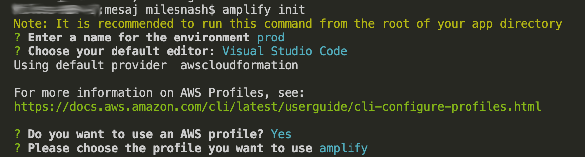

# Mesaj

## Prerequisites

* Node.js
* npm
* git
* go

## Before getting started

1. Install AWS Amplify

    ```bash
    npm install -g @aws-amplify/cli
    ```
    
2. If you've never used amplify before, you need to configure it

    ```bash
    amplify configure
    ```

## Deploying the app

1. Clone this repo and move into it

    ```bash
    git clone git@github.com:milesnash/mesaj.git
    cd mesaj
    ```

2.  Install npm dependencies

    ```bash
    npm i
    ```

3.  Initialise amplify

    ```bash
    amplify init
    ```

    Your answers to the init questions might look like these:

    

    Note that if you choose `prod` as your environment, the next step will create an optimised production build for the frontend.

4. Publish the front and backend

   **WARNING** This will provision resources in AWS for which you may be charged.

    ```bash
    amplify publish
    ```
    
5. Browse to the frontend URL that amplify outputs and you're done!

## Clean up

1. Run `amplify delete` to remove everything amplify published above from AWS. Note that this will delete a number of project files locally as well. Run `git checkout .` to return to a clean state.